# Seaborn-Aprendendo

### Aprendendo a Biblioteca Seaborn
<h1>Gráfico de barras</h1>

 Os gráficos de barras são uma forma popular de visualizar dados categóricos. O Seaborn oferece vários tipos de gráficos de barras, incluindo o gráfico de barras agrupadas, o gráfico de barras empilhadas e o gráfico de barras horizontais.

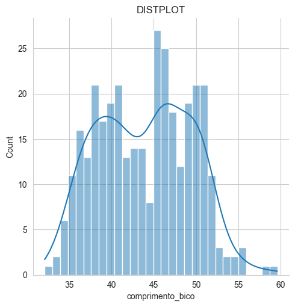

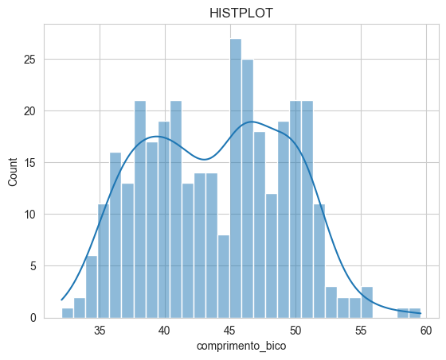

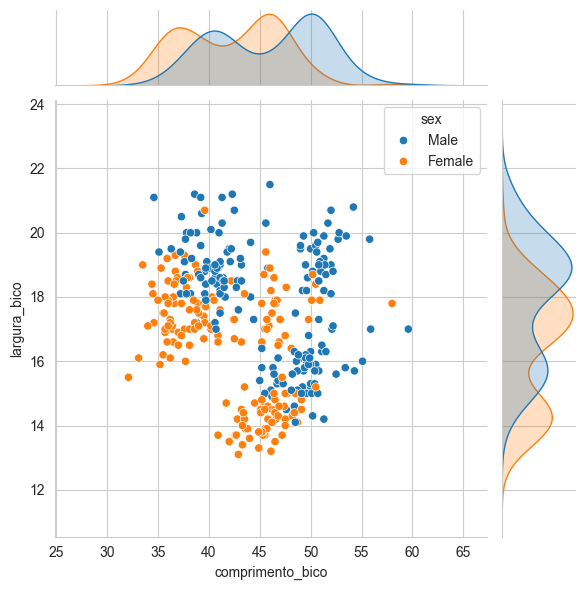

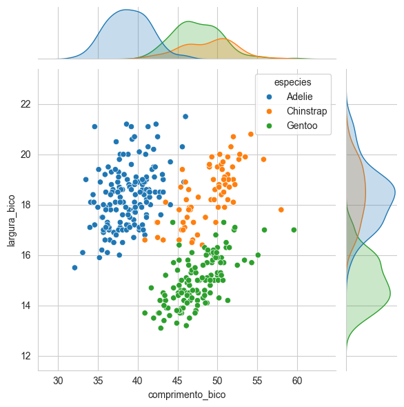

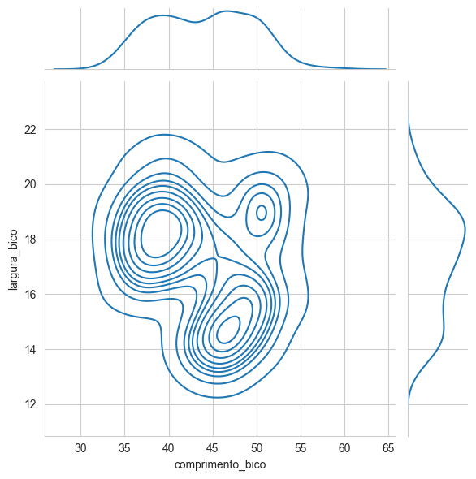

<h1> Gráfico de dispersão com regressão linear </h1>

 Os gráficos de dispersão são usados para visualizar a relação entre duas variáveis. O Seaborn oferece vários tipos de gráficos de dispersão, incluindo o gráfico de dispersão com linha de regressão e o gráfico de dispersão com hexágonos. 

 O gráfico de dispersão com linha de regressão é usado para visualizar a relação entre duas variáveis e a linha de regressão

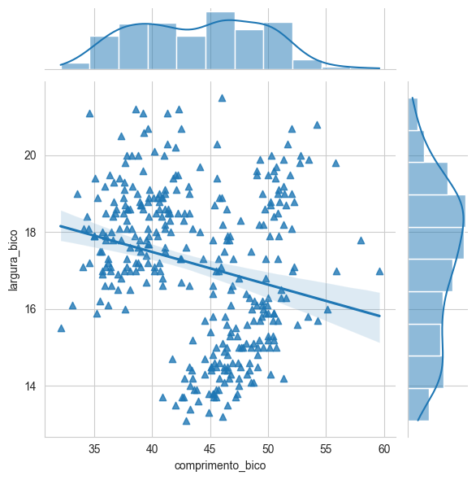

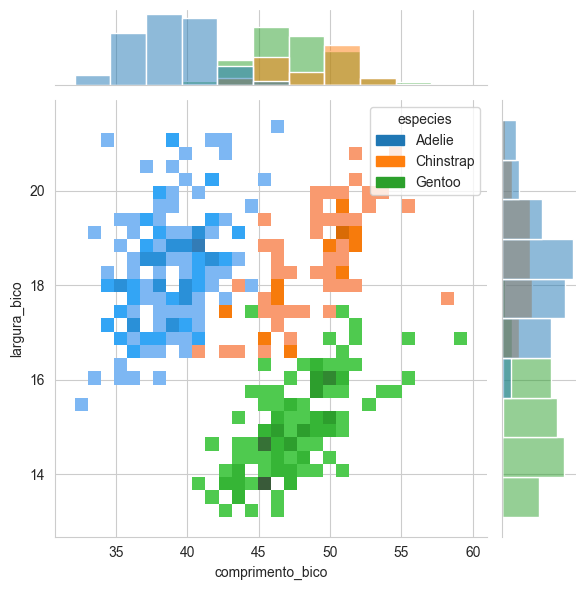

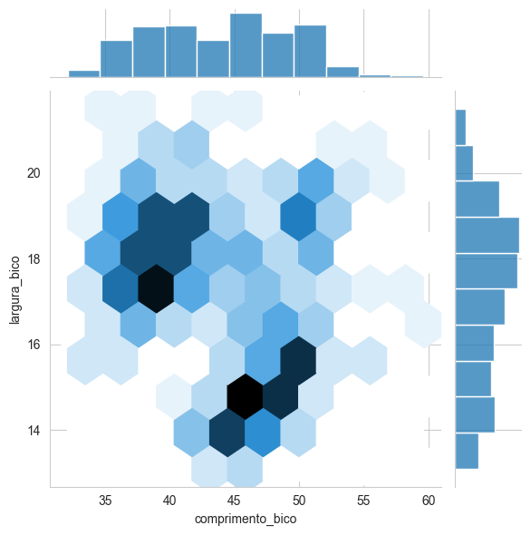

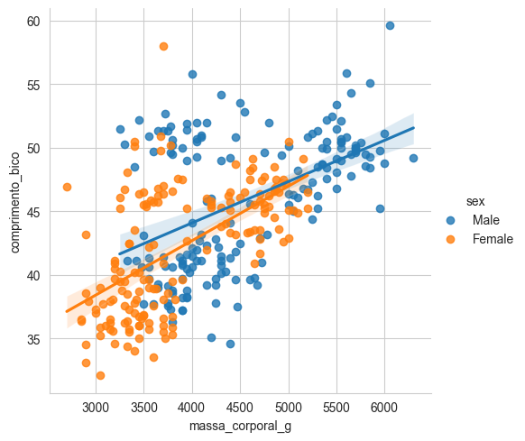

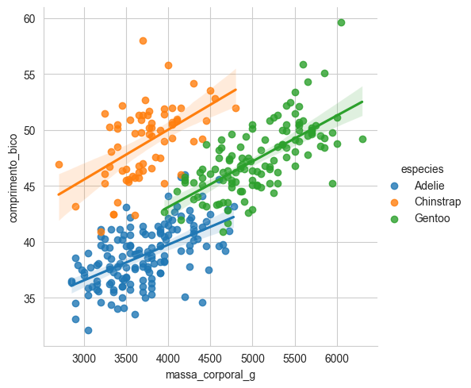

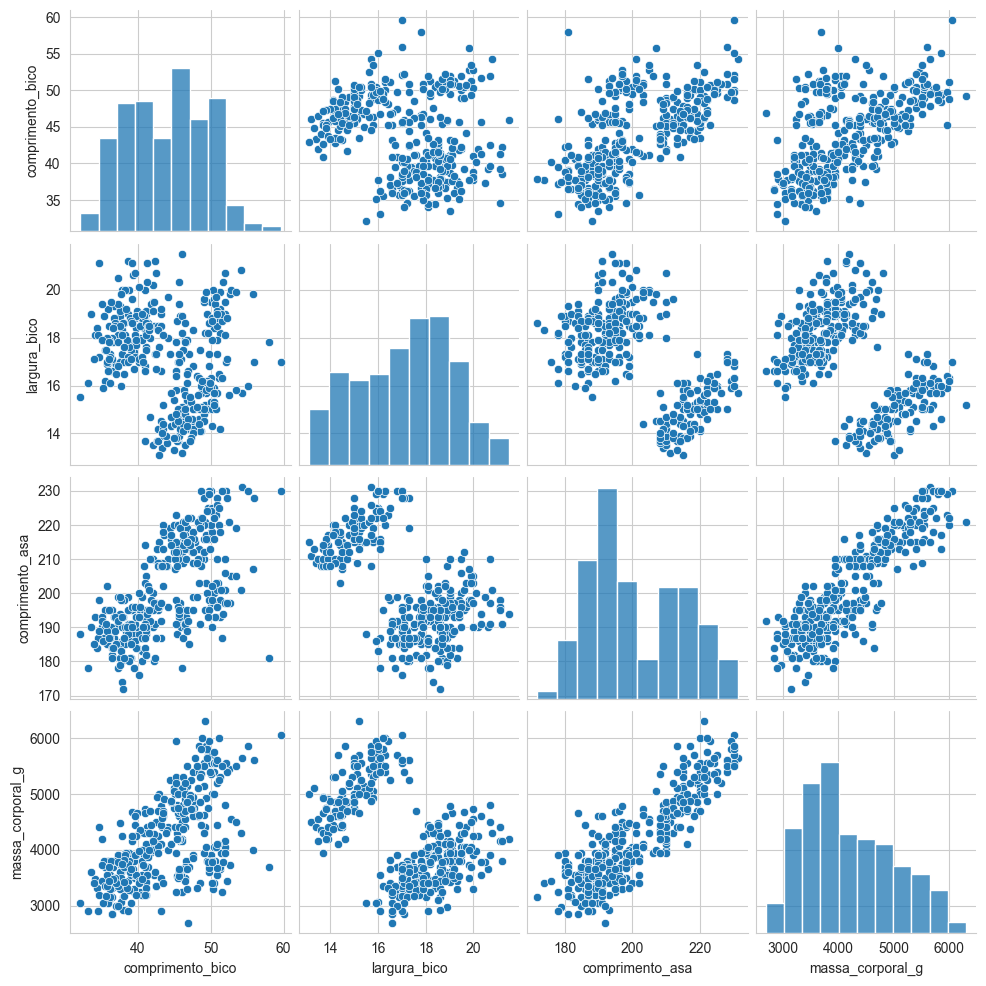

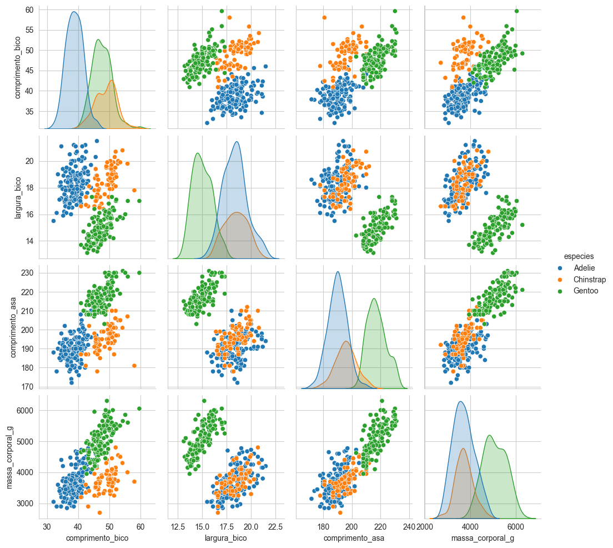

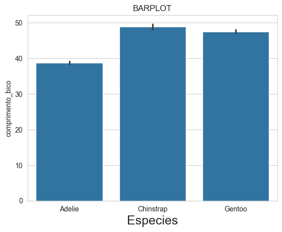

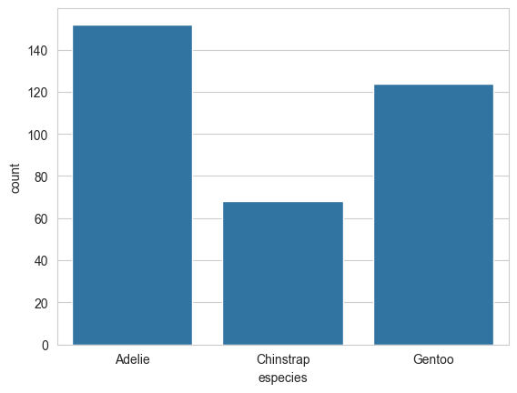

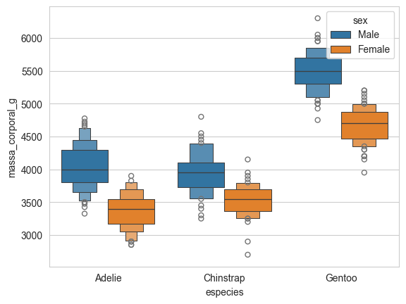

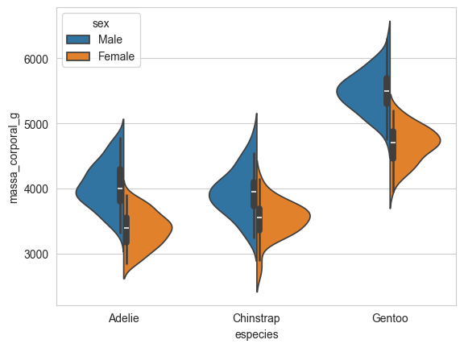

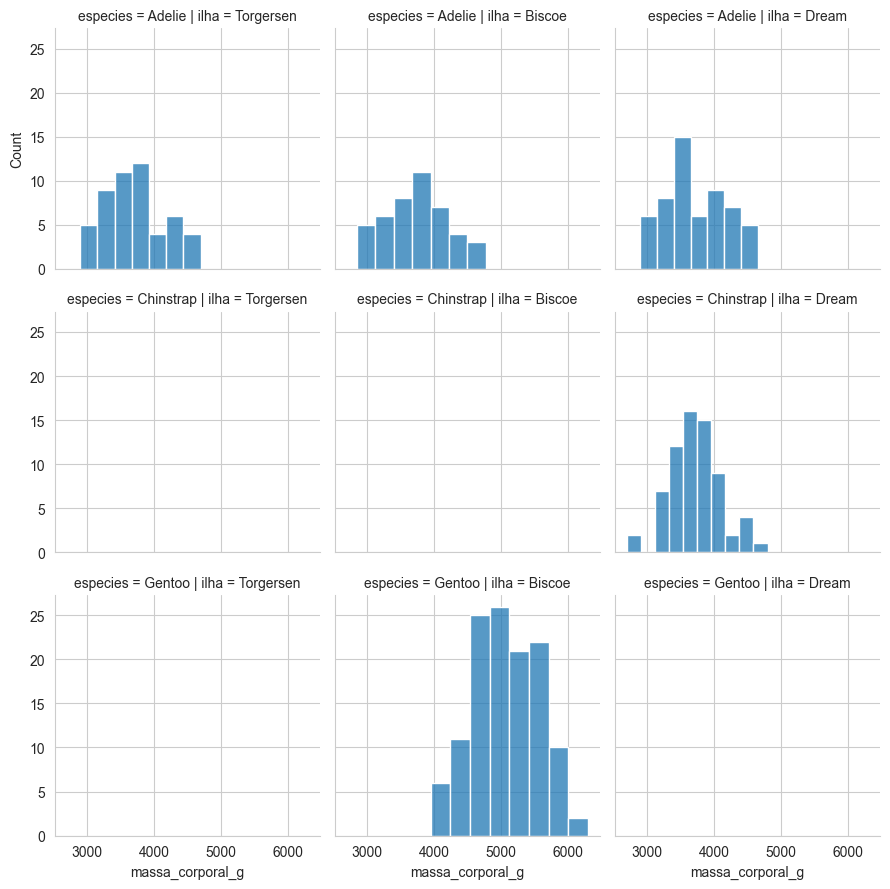

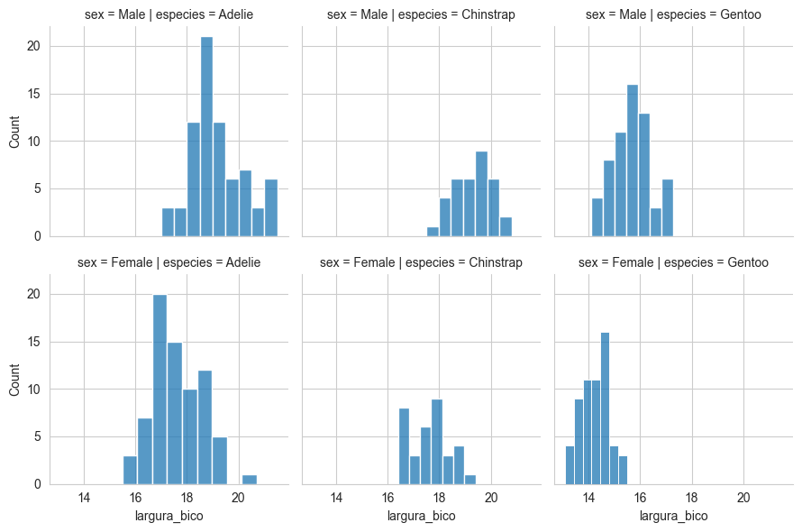

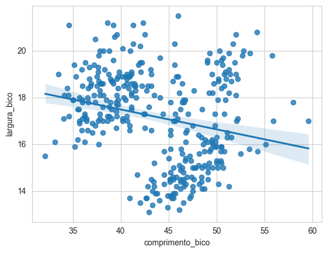

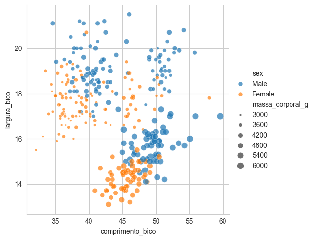

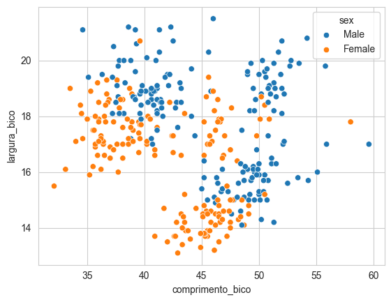
